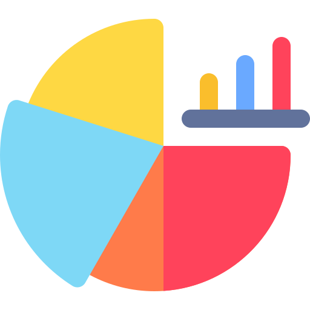

# GraphIt

GraphIt is a user-friendly web app built with Electron that simplifies graph creation using Chart.js. It not only helps you create and customize graphs effortlessly but also displays essential calculations like gradients, y-intercept values, and more.
"# GraphIt"

> 
